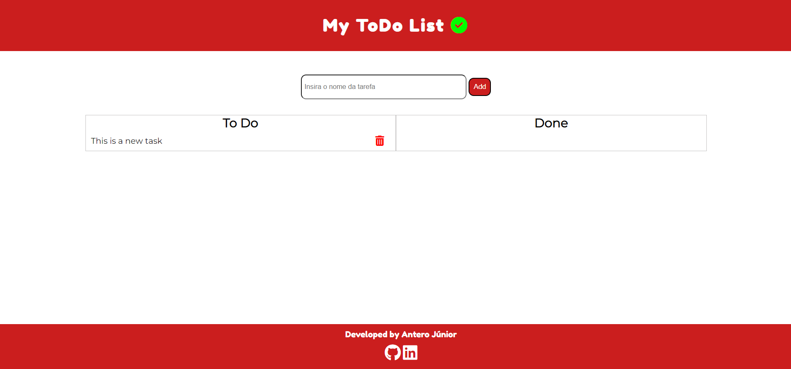

# Project #9 - ToDo List

 

## Development
I used for this project
- JavaScript (DOM API)
- HTML5
- CSS3 (Sass)
- Font Awesome (icons) and Google Fonts (font-family)

## How to use it
1. Insert the task name and then click on "Add" button to create a new task
2. When you finish the task, just click on it and the task will be moved to "Done" section
3. If you want to delete the task from your list, just click on the trash can

## Live
https://codepen.io/anterojunior/full/WNMxxJE
