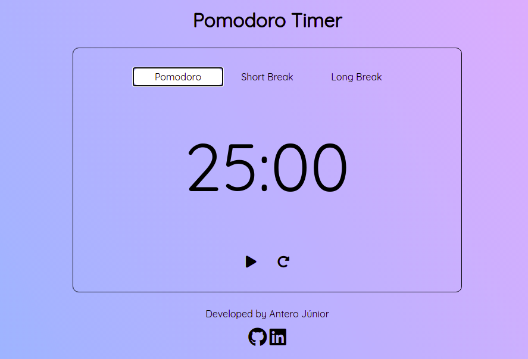

# Pomodoro Timer

Projeto simples e muito útil para colocar em prática alguns conhecimentos em JavaScript, HTML e CSS.

# Ferramentas
- HTML5
- CSS3 (Google Fonts, CSS Gradient e Font Awesome)
- JavaScript (DOM)

# Como usar
- Baixe o repositório e abra o arquivo 'index.html' no seu navegador de preferência;
- De início, não tem nada selecionado, logo, basta selecionar a opção entre Pomodoro (25:00), Short Break (05:00) e Long Break (30:00) e apertar o botão de início logo abaixo do tempo;
- Ao final do tempo, o usuário ouvirá um alarme e o tempo será pausado e reiniciado, podendo o usuário escolher a próxima opção;
- Durante a execução, o usuário poderá escolher entre pausar ou reiniciar o tempo por meio de botões abaixo do tempo restante;
- Para entender mais sobre a Técnica Pomodoro, acesse o link [Técnica Pomodoro - Wikipédia](https://pt.wikipedia.org/wiki/T%C3%A9cnica_pomodoro).

__Bons estudos!__

Obs: O projeto é para ser usado no computador!
