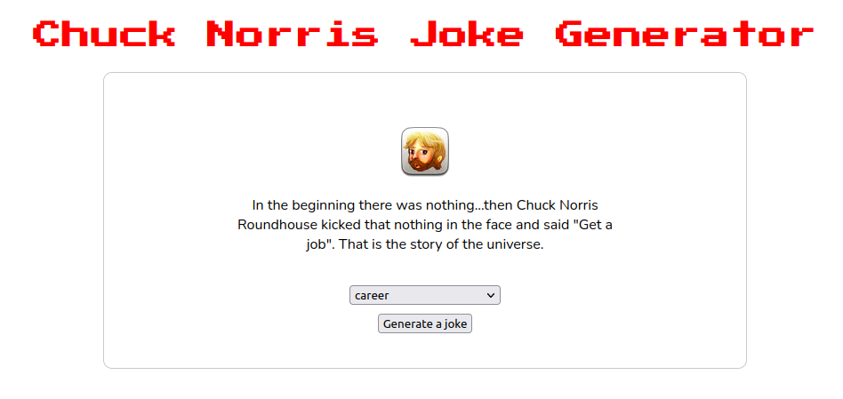

# Chuck Norris Jokes Generator

## How to use it
1. Select the category of the joke you want to read and click 'Generate a joke';
2. If you don't want a specific category, just leave '-- Choose an option --' selected and you'll get a random joke.

## How does the code work?
I used the Fetch API to [Chuck Norris API](https://api.chucknorris.io/) and I stylized the response (JSON) with CSS and appended to the page with 
JavaScript.

## Technologies 
- [x] HTML5, CSS3  
- [x] JavaScript (DOM API, Fetch API) 
- [x] Font Awesome 
- [x] Google Fonts
